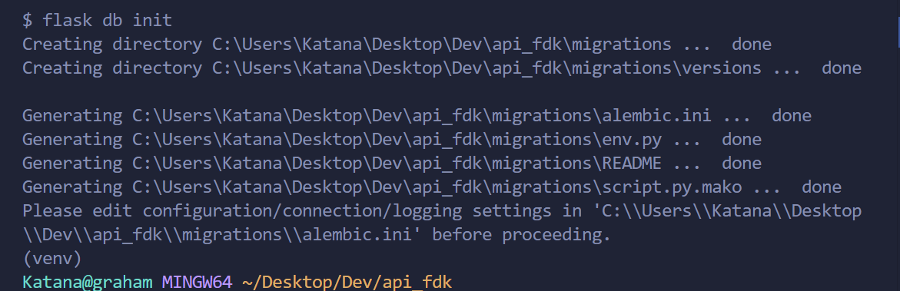
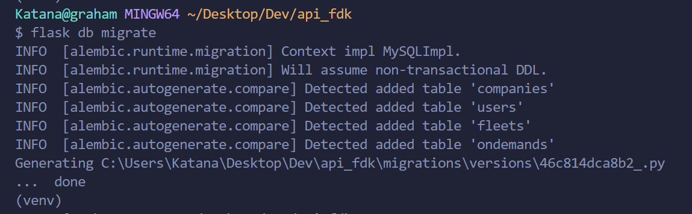
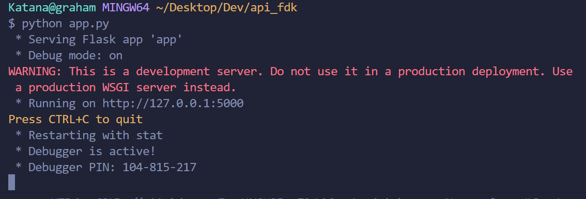
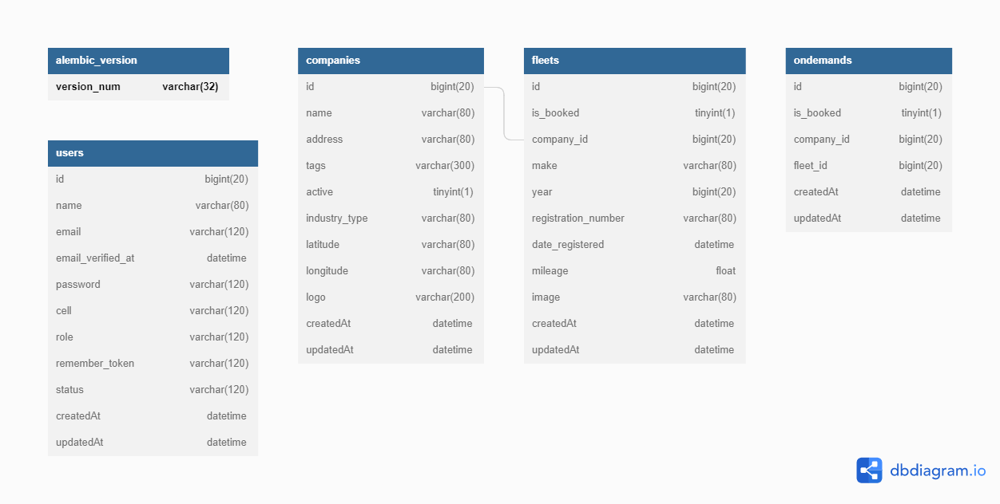

# DB setup
you can use any database just install the specific drivers, this project supports pgsql and mysql as in the .env
# Running the project
### Create a virtual environmen ```python -m venv [env_name]```
### Activate the virtual environment
### Install the dependencies ```pip install -r requirements.txt```
# Runnig the migrations
### ``` in the console, project dir: run flask db init```

### ``` in the console, project dir: run flask db migrate```

### ``` in the console(update migrations), project dir: run flask db upgrade```
### If everything ran well, you can run the app ```python app.py```


### DB Design

